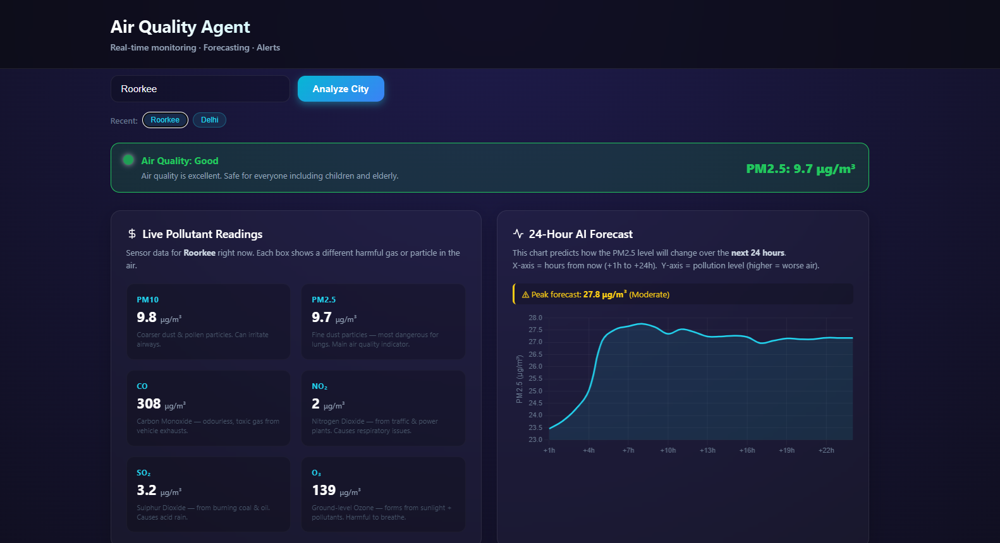

# Air Quality Monitoring & Pollution Prediction Agent 🌍

A Full-Stack Machine Learning web application that provides real-time air quality metrics and 24-hour pollution forecasts for any city in the world. 

Built with a **React** frontend, a **FastAPI** backend, and a **Random Forest Regressor** machine learning model.



## 🚀 Key Features

* **Interactive Satellite Map:** Click anywhere on the ESRI satellite map to instantly reverse-geocode the location and fetch its air quality data using Leaflet.js.
* **AI Pollution Forecasting:** A custom-trained Random Forest ML model uses a 24-hour sliding window algorithm to predict PM2.5 levels for the next 24 hours.
* **Real-time API Integration:** Fetches live environmental data asynchronously from the Open-Meteo API.
* **Smart Database Caching:** Utilizes a local SQLite database to cache API responses (reducing latency and network calls) and track user search history.
* **Beautiful Data Visualization:** Dynamic, responsive charts built with Chart.js to visualize the 24-hour forecast.
* **Containerized Deployment:** Fully Dockerized with Docker Compose for instant, one-click local deployment.

## 🛠️ Tech Stack

* **Frontend:** React, JavaScript (JSX), CSS3, Leaflet, Chart.js
* **Backend:** Python, FastAPI, aiohttp, SQLite
* **Machine Learning:** Scikit-learn (RandomForestRegressor), Pandas, NumPy, Joblib
* **DevOps:** Docker, Docker Compose
* **External APIs:** Open-Meteo (Geocoding & Air Quality)

## ⚙️ How to Run Locally

Because this project is fully containerized, you can run the entire stack (Frontend, Backend, and Database) with a single command. You do not need to install Python, Node, or any dependencies locally.

### Prerequisites
* [Docker Desktop](https://www.docker.com/products/docker-desktop/) installed on your machine.

### Installation Steps

1. Clone the repository:
   ```bash
   git clone https://github.com/yourusername/air-quality-agent.git
   cd air-quality-agent
   ```

2. Start the Docker containers:
   ```bash
   docker-compose up --build
   ```

3. Open your browser and navigate to:
   - **Frontend UI:** `http://localhost:3000`
   - **Backend API Docs:** `http://localhost:8000/docs`

## 🧠 Machine Learning Architecture

The AI model is located in the `model/` directory.
1. `fetch_data.py`: Collects 30 days of historical hourly pollution data to build the training dataset (`aqi_hourly.csv`).
2. `train_model.py`: Parses the dataset, engineers a 24-hour rolling window feature set, and trains the `RandomForestRegressor`.
3. `model.py`: Loaded into memory by the FastAPI server to provide sub-second inference for live user requests.

---
*Built by Atul Kumar*
